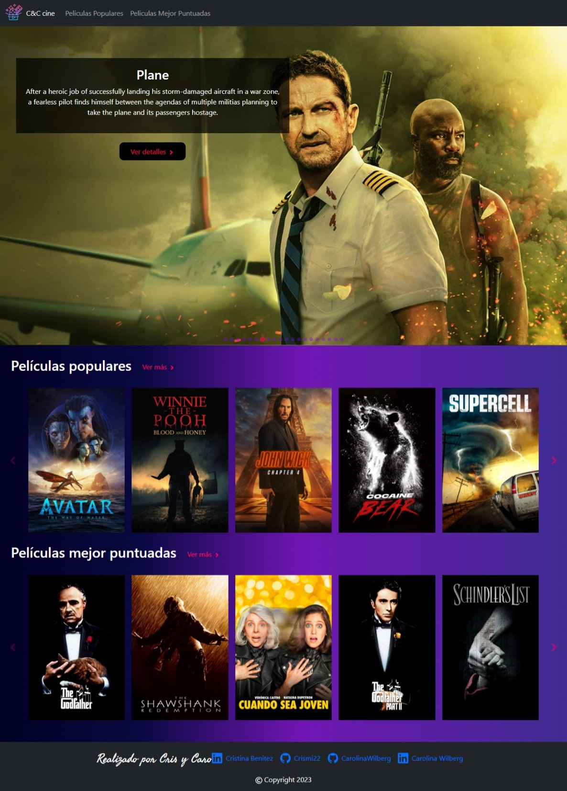

# Trabajo práctico final de ADA : módulo de React.
## BUSCADOR DE PELICULAS 

## Esta es una aplicación de películas creada con React y utiliza la base de datos de películas TMDb a través de su API.

Instalación
Clona este repositorio: git clone https://github.com/tu-usuario/app-peliculas.git.
Ve a la carpeta de la aplicación: cd app-peliculas.
Instala las dependencias: npm install.
Crea un archivo .env en la raíz del proyecto y agrega tu clave de API de TMDb: REACT_APP_TMDB_API_KEY=clave-de-api.
Inicia la aplicación: npm start.

---

## Deployado 🚀

[Enlace - React Movies](https://movies-react-kappa.vercel.app/)

## Funcionalidades ⚙️
- Ver una lista de las películas populares.
- Ver una lista de las peliculas mejores puntuadas.
- Ver un carrousel con las peliculas que estan en cartelera.
- Buscar películas por nombre.
- Ver detalles de una película en particular.
- Paginación para ver las películas en grupos de 20.

## Tecnologías utilizadas | Herramientas 🛠️
- React
- React Router
- CSS
- API de The Movie Database (TMDb)
- react-bootstrap 
- react-icons
- react-paginate 
- react-slick
- slick-carousel

### Uso
- Cuando la aplicación esté cargada, verás un carrousel principal donde se muestran las peliculas que estan en cine.
- En Home tambien muestra dos carrouseles con una lista de películas populares y mejores puntuadas.
- Puedes buscar películas ingresando un término de búsqueda en la barra de búsqueda.
- Haz clic en una película para ver más detalles sobre ella.
- Puedes navegar por las páginas de resultados utilizando los botones de paginación en la parte inferior de la lista de películas.

## Autores 👩🏽‍💻

- Cristina Benitez - [Crismi22](href="https://github.com/Crismi22)
- Carolina Wilberg - [CarolinaWilberg](href="https://github.com/CarolinaWilberg)

---

El proyecto cuenta con diseño responsive para mejorar la experiencia del usuario.

Hecho con 💜 Cris y Caro

